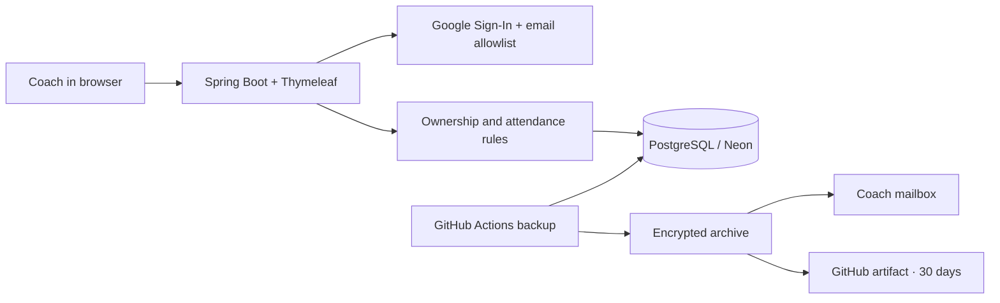

<div align="center">

# ⚽ Touchline

### Every player. Every training. Every attendance record.

A football attendance workspace for coaches to organize generations, plan training, and see who is showing up.

**Java 17 · Spring Boot 4.1.1 · Thymeleaf · PostgreSQL · Google Sign-In**

[Open Touchline](https://touchline-7ui9.onrender.com) · [Getting started](#getting-started) · [Deployment](#deploying-to-render) · [Backups](#database-backups)

*Access to the hosted application is restricted to approved Google accounts.*

</div>

---

## Built for the coach

Attendance should take a few clicks, not a spreadsheet. Touchline brings a coach’s player rosters, training schedule, and attendance history into one place.

Players are organized into **generations**—groups identified by a name and birth year. The coach creates a training session the day before, opens it on training day, selects the players who are present, and saves. Touchline records everyone else as absent and updates the dashboard.

> **The sixth absence triggers an alert.** Absences accumulate across all recorded sessions for the player’s generation, with no automatic seasonal reset.

## What you can do

| Feature | How it works |
| --- | --- |
| **Generation management** | Create, view, rename, and delete generations with their own player rosters. |
| **Player management** | Add players, edit names and shirt numbers, review individual attendance history, and delete records. Shirt numbers are unique within a generation. |
| **Manual training schedule** | Create tomorrow’s session with a start/end time, location, and notes. Sessions are organized by date and weekday; they do not recur automatically. |
| **Attendance in a few clicks** | Select a player’s name/card to mark them present. Save the sheet to record attendance. |
| **Absence tracking** | View saved-session counts, absence totals, rounded absence percentages, and alerts for players with six or more absences. |
| **Corrections and history** | Reopen saved attendance to make corrections, or delete a sheet to return the session to pending. |
| **Restricted Google login** | Only verified Google email addresses in the configured allowlist can sign in. |
| **Daily backup workflow** | Export Neon, encrypt the backup, email it, and retain an encrypted GitHub artifact. Requires separate setup. |

## From planning to attendance

1. **Sign in** with an approved Google account.
2. **Create a generation** and add its players.
3. **Plan tomorrow’s training** by choosing its time, pitch, and notes.
4. **Open the session on training day** and click the names of players who are present.
5. **Save attendance.** Unselected players become absent, and totals and notifications update.
6. **Review progress** from the dashboard or a player’s training history.

### The rules behind the numbers

- **Nothing counts until attendance is saved.** Future, pending, and cancelled sessions do not create absences.
- **Absence percentage = absences ÷ saved attendance records × 100**, rounded to the nearest whole percent. A player with no records displays `—`.
- **Five absences do not trigger an alert; six do.** Correcting an attendance sheet can clear an alert.
- **Saved rosters preserve history.** Adding a new player does not add them to previously saved attendance sheets.
- **Past sessions can be recorded late.** Future attendance cannot be saved, and empty rosters cannot be submitted.
- **Training times cannot overlap** in a coach’s schedule.
- **Stale session submissions are rejected** when another tab has already updated the session.

### Editing and deletion

Open a generation or training session to find its edit and delete controls. Click a player’s name in an attendance summary to open their profile and history.

| Operation | Effect |
| --- | --- |
| Edit a player | Updates their name and shirt number. Generation and enrollment date stay fixed. |
| Edit a session | Updates time, pitch, and notes. Unrecorded sessions can keep their date or move to tomorrow; recorded dates and the generation stay fixed. |
| Cancel a session | Allowed before attendance is saved. The session stays visible without counting absences. |
| Delete an attendance sheet | Removes its marks and returns the session to pending. You can take attendance again. |
| Delete a player | Removes the player and their attendance history. Other players and sessions remain. |
| Delete a session | Removes the session and its attendance records. |
| Delete a generation | Removes the generation, its players, sessions, and attendance. |

Delete forms require confirmation. Deletions are permanent, and affected totals and alerts are recalculated.

## Accounts and access

There is one application role: **`ROLE_COACH`**. Players are roster records and do not have accounts.

Each coach can access only their own generations, players, training sessions, and attendance. Even when two coaches are approved, they have separate workspaces.

Set `allowed_coach_emails` to a comma-separated list of permitted Google addresses. Matching ignores capitalization and surrounding spaces. Google must verify the email; aliases are not automatically treated as equivalent addresses. **An empty or missing allowlist blocks all logins.** Records remain linked to Google’s stable account subject.

Form submissions and logout use CSRF-protected POST requests, with ownership checks in the application service.

## Technology and architecture

| Layer | Technology |
| --- | --- |
| Backend | Java 17, Spring Boot 4.1.1, Spring MVC |
| Authentication | Spring Security, Google OAuth 2.0 / OpenID Connect |
| Persistence | Spring Data JPA, Hibernate, PostgreSQL / Neon |
| Local fallback | File-based H2 database |
| Database migrations | Flyway; Hibernate validates the resulting schema |
| Interface | Server-rendered Thymeleaf pages and responsive CSS |
| Hosting | Docker on Render |
| Backup automation | GitHub Actions, PostgreSQL tools, GPG, Python, SMTP |



```text
src/main/java/atrck/attendancetracker/
├── AttendanceTrackerApplication.java
├── config/        Optional demo-data startup runner
├── controller/    Page routes, form submissions, validation responses
├── model/         Generation, Player, TrainingSession, PlayerAttendance
├── repository/    Spring Data repositories
├── security/      Google login, email allowlist, application clock
└── service/       Attendance rules, ownership checks, summaries, sample data

src/main/resources/
├── templates/     Login, dashboard, generation, player and training pages
├── static/        Responsive styling
└── db/migration/  Versioned Flyway SQL migrations

src/test/          Application, security and workflow tests
scripts/           Database backup script and its tests
.github/workflows/ Daily backup workflow
docs/              Backup configuration and recovery instructions
```

## Getting started

### 1. Clone the project

Install **JDK 17**. The repository includes the Maven wrapper, so a separate Maven installation is not required.

```powershell
git clone https://github.com/fejmiqaz/Touchline.git
cd Touchline
```

### 2. Configure Google login

Create a Google OAuth **Web application** client and register this authorized redirect URI:

```text
http://localhost:8080/login/oauth2/code/google
```

If your Google consent configuration restricts access to test users, add the accounts you intend to use there as well.

### 3. Set environment variables

| Variable | Purpose | Default |
| --- | --- | --- |
| `GOOGLE_CLIENT_ID` | Google OAuth client ID | Login needs configuration |
| `GOOGLE_CLIENT_SECRET` | Google OAuth client secret | Login needs configuration |
| `allowed_coach_emails` | Approved Google email addresses, comma-separated | No accounts allowed |
| `DATABASE_URL` | JDBC database URL | Local H2 file outside the Render profile |
| `DATABASE_USERNAME` | Database role | `sa` locally |
| `DATABASE_PASSWORD` | Database role password | Empty locally |
| `APP_TIME_ZONE` | Calendar timezone | `Europe/Skopje` |

For a local H2 setup, run in PowerShell:

```powershell
$env:GOOGLE_CLIENT_ID = 'your-client-id'
$env:GOOGLE_CLIENT_SECRET = 'your-client-secret'
$env:allowed_coach_emails = 'coach1@gmail.com,coach2@gmail.com'
.\mvnw.cmd spring-boot:run
```

Open [localhost:8080](http://localhost:8080). H2 data persists in `data/attendance.mv.db`.

For a **Neon development database**, also set these before starting:

```powershell
$env:DATABASE_URL = 'jdbc:postgresql://YOUR_DEVELOPMENT_HOST:5432/neondb?sslmode=require'
$env:DATABASE_USERNAME = 'neondb_owner'
$env:DATABASE_PASSWORD = 'your-development-password'
```

Use the connection details from your development branch. Keep the username and password separate from the JDBC URL.

**Using IntelliJ?** Add the same variables under **Run → Edit Configurations → Environment variables**, then run `AttendanceTrackerApplication`. PowerShell variables only apply to processes started from that terminal. The app does not automatically load a `.env` file.

## Development and database migrations

Keep development and production connections separate:

| Environment | Database |
| --- | --- |
| IntelliJ / local application | Neon development branch, or local H2 |
| Render | Neon production branch |
| GitHub backup workflow | Neon production branch |

For schema changes, add a new SQL file under `src/main/resources/db/migration`, using the next unused version—for example, `V3__add_player_position.sql`. Update the Java model, run against development, and test. Commit the SQL file together with the code.

On the next deployment, Flyway applies pending migrations to production during startup. **Do not modify already-applied migration files.** Keep `spring.jpa.hibernate.ddl-auto=validate`.

Database rows do not move through GitHub: test players and attendance stay in development. Transferring selected data requires a separate import. Confirm a successful production backup before migrations that change or remove existing data.

<details>
<summary>Why are there school-related tables in the initial migration?</summary>

The project originally began as a student attendance tracker. `V1__attendance.sql` preserves that initial schema; `V2__football.sql` introduces the football model. The football application does not use the original school tables. Keeping applied migrations unchanged preserves Flyway history.

</details>

## Deploying to Render

The included multi-stage `Dockerfile` builds and tests the application, then runs the packaged JAR with the `render` profile. That profile uses Render’s port, supports HTTPS forwarding, enables secure session cookies, and requires database credentials.

1. Push the project to GitHub and create a Render **Web Service** from the repository.
2. Select **Docker**, leave the root directory empty, and use `./Dockerfile`.
3. Add the Google credentials, `allowed_coach_emails`, and **production** database variables listed above.
4. Use `/login` as the HTTP health check path, then deploy.
5. In the Google OAuth client, add your deployed callback URL:

   ```text
   https://YOUR-SERVICE.onrender.com/login/oauth2/code/google
   ```

Keep the localhost callback for development. The deployed URL must exactly match the authorized Google redirect URI. No custom Docker command is needed.

## Try it with sample data

The optional importer creates **3 Sample Academy generations, 36 fictional players, and 33 training sessions**:

- 24 sessions with saved attendance.
- 3 sessions for the import day, ready for taking attendance.
- 3 sessions for the following day.
- 3 cancelled sessions.

Each generation includes one player with six absences and another with five, making the alert boundary easy to explore.

<details>
<summary>Import sample data into a development database</summary>

With your development database environment variables configured, supply the coach’s Google OIDC subject—not their email address:

```powershell
.\mvnw.cmd spring-boot:run '-Dspring-boot.run.arguments=--app.demo.owner=GOOGLE_SUBJECT --app.demo.exit-after-seeding=true --server.port=0'
```

Stop the regular application first if it uses the same local H2 file. The importer skips sample generations already present, does not reset their attendance, and does not bypass Google login. Dates are relative to the initial import date and are preserved when rerun. Sample data is not automatically included in a fresh database.

</details>

## Database backups

The included workflow exports Neon **daily at 03:17 UTC**, validates the archive structure, encrypts it with GPG AES-256, and emails the encrypted attachment. It also retains an encrypted GitHub artifact for **30 days**.

**This requires activation:** push the workflow to the default branch, configure GitHub secrets, and complete a successful manual run. The application’s Render variables are separate from GitHub Actions secrets.

See **[backup setup and recovery instructions](docs/database-backups.md)** for the secret names, SMTP configuration, attachment limits, scheduling limitations, and restore procedure. Keep the encryption passphrase separately and test recovery before relying on the backups. An archive structure check is not a full restore test.

## Verification

Run the application tests:

```powershell
.\mvnw.cmd test
```

Run the backup script tests with Python 3:

```powershell
python -m unittest discover -s scripts -p 'test_*.py'
```

Coverage includes attendance thresholds and percentages, corrections, saved rosters, scheduling validation, CRUD operations, coach isolation, email allowlisting, CSRF protection, and page rendering. Application tests use an independent in-memory database. Backup tests mock database export and email delivery.

Real Google sign-in, Neon connectivity, SMTP delivery, and database recovery need checks with configured external services.
